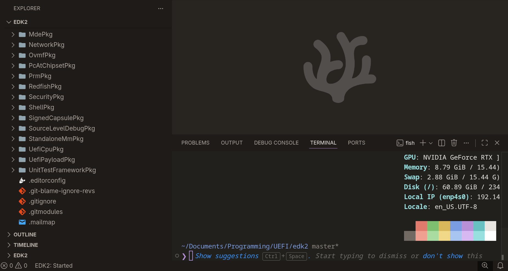
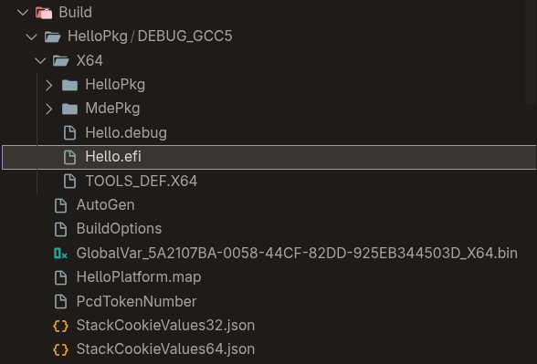
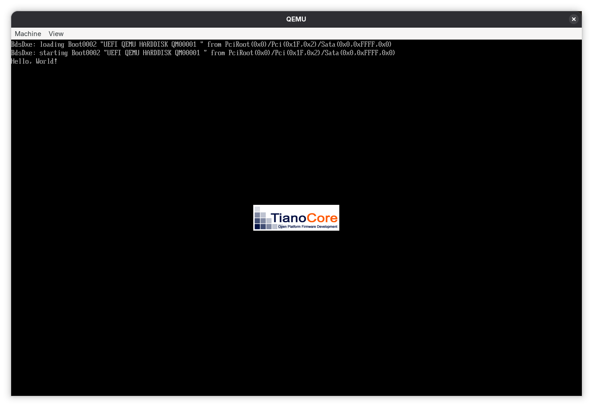

+++
title = "(Part 2) Snake in... UEFI?"
description = "With an overview of the UEFI boot process complete, we can finally start practicing!"
date = "2026-02-09T16:44:54.000+01:00"
cover = ""
toc = true
tags = ["edk2", "uefi", "firmware"]
+++

Let's resume from [where we left off](../part-1-snake-in-uefi/), shall we?

## Recap from Part 1

In Part 1, we discussed why UEFI development matters, how a UEFI-compliant device boots in a high-level way, from **SEC** to **BDS phases**, and last but not least _where_ our Snake game will run.

## Now what?

Now that we laid out the basics, we're finally ready for practice!

You may have noticed that I've (not so) subtly mentioned [EDK II](https://github.com/tianocore/edk2), an essential toolchain for UEFI development. However alternatives exist, such as [gnu-efi](https://wiki.osdev.org/GNU-EFI).

I chose EDK II because it's more mature and quite literally _drops you_ into the UEFI ecosystem, with ready-to-use helper functions that fall outside the specification, like [`TranslateBmpToGopBlt`](https://github.com/tianocore/edk2/blob/master/MdeModulePkg/Library/BaseBmpSupportLib/BmpSupportLib.c#L80).

Using an alternative like **gnu-efi** would likely require implementing many of these manually.

In essence, we're buying time and simplicity by using EDK II, which is a popular reason that most IBVs base their firmware solutions on it nowadays.

### Setting up the EDK2 tree

Setting up TianoCore's EDK2 is pretty trivial, thanks to [its concise setup instructions](https://github.com/tianocore/edk2?tab=readme-ov-file#submodules). It's as simple as cloning the repository and initializing its submodules!

```bash
git clone https://github.com/tianocore/edk2
cd edk2
git submodule update --init
```



I also like to use a VSCode extension made by Intel called [EDK2Code](https://github.com/intel/Edk2Code). It has many great features, like "Go-To" support for references in `.inf` and `.dsc` files, and the ability to **automatically configure clangd**.

## Creating our platform folder

With EDK II set up, the next step is to define our own platform. In EDK II terminology, a platform represents the full build description of what we want to produce, even if that result is something as small as a single UEFI application.

We start by creating a new package directory, which will host all files related to our Snake project.

Inside this package, we place a `.dsc` file: this file acts as the entry point for the EDK II build system and describes how the platform is built, which modules are included, and which libraries and configuration values apply globally.

Below is the complete DSC file for our Snake platform, and we'll go through each section and explain what it does.

### `.dsc` Sections

#### `[Defines]` Section

```ini
[Defines]
  PLATFORM_NAME                  = SnakePlatform
  PLATFORM_GUID                  = 811F95EC-492F-45A5-9309-81B0DD5D4D82
  PLATFORM_VERSION               = 1.0
  DSC_SPECIFICATION              = 0x00010005
  OUTPUT_DIRECTORY               = Build/SnakePkg
  SUPPORTED_ARCHITECTURES        = X64|IA32
  BUILD_TARGETS                  = DEBUG|RELEASE
  SKUID_IDENTIFIER               = DEFAULT
```

The `[Defines]` section contains high level information about the platform: it gives the platform a name and a GUID (`PLATFORM_GUID`), declares which CPU architectures are supported (here, `X64` and `IA32` architectures), and specifies which build targets are allowed (`DEBUG` and `RELEASE`).

The output directory controls where build artifacts are generated. These values are primarily consumed by the EDK II build system rather than by firmware code itself.

#### `[LibraryClasses]` Section

<details>
  <summary>Click to expand</summary>

  ```ini
  [LibraryClasses]
    UefiApplicationEntryPoint|MdePkg/Library/UefiApplicationEntryPoint/UefiApplicationEntryPoint.inf
    UefiLib|MdePkg/Library/UefiLib/UefiLib.inf
    ...
    inf
  !if $(TARGET) == DEBUG
    DebugLib|MdePkg/Library/UefiDebugLibConOut/UefiDebugLibConOut.inf
    DebugPrintErrorLevelLib|MdePkg/Library/BaseDebugPrintErrorLevelLib/BaseDebugPrintErrorLevelLib.inf
  !else
    DebugLib|MdePkg/Library/BaseDebugLibNull/BaseDebugLibNull.inf
  !endif
    ...
  ```
</details>

The `[LibraryClasses]` section defines how abstract library classes are resolved into concrete implementations.

When a module depends on a library class, the DSC decides which implementation is linked.

Conditional directives (like `!if $(TARGET) == DEBUG`) allow different libraries to be selected depending on the build target. In this case, debug builds use console based debug output, while release builds link against "`Null`" implementations (like `BaseDebugLibNull`) that remove debugging code entirely.

#### `[Components]` Section

```ini
[Components]
  SnakePkg/Snake/Snake.inf
```

The `[Components]` section lists the modules that are part of the platform. Each entry refers to an `.inf` file that describes a single module: only modules listed here are built and included!

#### `[PcdsFixedAtBuild]` Section

```ini
[PcdsFixedAtBuild]
!if $(TARGET) == DEBUG
  gEfiMdePkgTokenSpaceGuid.PcdDebugPropertyMask|0xFF
!endif
```

The `[PcdsFixedAtBuild]` section defines platform configuration values that are fixed at build time. These values are compiled directly into the binaries; here we enable all debug properties for debug builds.

### You mentioned `Snake.inf` though!

That's true, and now that we have our platform file ready, we need to tell EDK II about the Snake game itself. This is where `Snake.inf` comes in. The INF file is like the personal ID card for our module. It says who we are, what we do, what we need, and where to start running.

### `.inf` Sections

#### `[Defines]` Section

```ini
[Defines]
  INF_VERSION                     = 1.25
  BASE_NAME                       = Snake
  FILE_GUID                       = 125FBE2E-8095-484D-BB6F-465262530D87
  MODULE_TYPE                     = UEFI_APPLICATION
  VERSION_STRING                  = 1.0
  ENTRY_POINT                     = UefiMain
  UEFI_HII_RESOURCE_SECTION       = TRUE # VERY IMPORTANT
```

Pretty much the same use case as [earlier](#defines-section). `INF_VERSION` tells the build system which format we are using. `BASE_NAME` is the name that will appear in build outputs. `FILE_GUID` is the unique fingerprint for this module. `MODULE_TYPE` says we are a UEFI application (and not a [`UEFI_DRIVER`](../part-1-snake-in-uefi/#thats-great-but-what-about-snake)!). `VERSION_STRING` is for humans. `ENTRY_POINT` tells the firmware where to jump in, and `UEFI_HII_RESOURCE_SECTION` ensures our images and UI resources get packaged correctly!

#### `[Sources]` Section

```ini
[Sources]
  Assets/Logo.bmp
  Assets/Logo.idf
  Snake.c
  ...
```

The `[Sources]` section lists all the files that make up our game. This includes C source files, headers, and the graphics assets. EDK II will compile or package everything here into the final module.

#### `[Packages]` Section

```ini
[Packages]
  MdePkg/MdePkg.dec
  MdeModulePkg/MdeModulePkg.dec
```

The `[Packages]` section points to `.dec` files that provide shared protocols, libraries, and constants. See `.dec` files as ready-to-go toolboxes for UEFI engineers to use in code, without having to redefine every GUIDs or constants themselves.

#### `[Protocols]` Section

```ini
[Protocols]
  gEfiGraphicsOutputProtocolGuid      ## CONSUMES # For graphics
  gEfiHiiPackageListProtocolGuid      ## CONSUMES # For retrieving the HII resources section
  gEfiLoadedImageProtocolGuid         ## CONSUMES
  gEfiHiiDatabaseProtocolGuid         ## CONSUMES ## PRODUCES # To add the Tianocore image
  gEfiHiiImageProtocolGuid            ## CONSUMES # To get the Tianocore image
```

The `[Protocols]` section is a list of software interfaces that are uniquely identified by a GUID, which can be published by one module and consumed by other modules at runtime.

We consume protocols to use graphics and HII services, and we produce protocols when we provide a resource, like our logo, for use to use.

#### `[LibraryClasses]` Section

```ini
[LibraryClasses]
  UefiApplicationEntryPoint
  UefiLib
  DebugLib
  UefiBootServicesTableLib
  UefiRuntimeServicesTableLib
  MemoryAllocationLib
  BaseMemoryLib
```

Remember [when we defined what `[LibraryClasses]` was earlier](#libraryclasses-section)? Each module can use a set of library classes that were defined earlier in the DSC file, without having to provide the implementation's full path. In turn, this section will grant the module usage of those library classes.

### And the hello world app you promised?

True, now is the right time to write it. Now that we've got the basics out of the way, we can create a folder at the root of the EDK II tree named `HelloPkg` with the following structure:

```
HelloPkg/
├─ HelloPkg.dsc
├─ Hello/
│  ├─ Hello.c
│  ├─ Hello.inf
```

#### The boring files

The DSC file would look like this:

<details>
  <summary>Click to expand</summary>

  ```ini
  [Defines]
    PLATFORM_NAME                  = HelloPlatform
    PLATFORM_GUID                  = 5A2107BA-0058-44CF-82DD-925EB344503D
    PLATFORM_VERSION               = 1.0
    DSC_SPECIFICATION              = 0x00010005
    OUTPUT_DIRECTORY               = Build/SnakePkg
    SUPPORTED_ARCHITECTURES        = X64|IA32
    BUILD_TARGETS                  = DEBUG|RELEASE
    SKUID_IDENTIFIER               = DEFAULT

  [LibraryClasses]
    UefiApplicationEntryPoint|MdePkg/Library/UefiApplicationEntryPoint/UefiApplicationEntryPoint.inf
    UefiLib|MdePkg/Library/UefiLib/UefiLib.inf
    UefiBootServicesTableLib|MdePkg/Library/UefiBootServicesTableLib/UefiBootServicesTableLib.inf
    MemoryAllocationLib|MdePkg/Library/UefiMemoryAllocationLib/UefiMemoryAllocationLib.inf
    BaseMemoryLib|MdePkg/Library/BaseMemoryLibRepStr/BaseMemoryLibRepStr.inf
  !if $(TARGET) == DEBUG
    DebugLib|MdePkg/Library/UefiDebugLibConOut/UefiDebugLibConOut.inf
    DebugPrintErrorLevelLib|MdePkg/Library/BaseDebugPrintErrorLevelLib/BaseDebugPrintErrorLevelLib.inf
  !else
    DebugLib|MdePkg/Library/BaseDebugLibNull/BaseDebugLibNull.inf
  !endif
    BaseLib|MdePkg/Library/BaseLib/BaseLib.inf
    PcdLib|MdePkg/Library/BasePcdLibNull/BasePcdLibNull.inf
    RegisterFilterLib|MdePkg/Library/RegisterFilterLibNull/RegisterFilterLibNull.inf
    PrintLib|MdePkg/Library/BasePrintLib/BasePrintLib.inf
    DevicePathLib|MdePkg/Library/UefiDevicePathLib/UefiDevicePathLib.inf
    UefiRuntimeServicesTableLib|MdePkg/Library/UefiRuntimeServicesTableLib/UefiRuntimeServicesTableLib.inf
    StackCheckLib|MdePkg/Library/StackCheckLibNull/StackCheckLibNull.inf

  [Components]
    HelloPkg/Hello/Hello.inf

  [PcdsFixedAtBuild]
  !if $(TARGET) == DEBUG
    gEfiMdePkgTokenSpaceGuid.PcdDebugPropertyMask|0xFF
  !endif
  ```
</details>

And the `Hello.inf` would look like this:

<details>
  <summary>Click to expand</summary>

  ```ini
  [Defines]
    INF_VERSION                     = 1.25
    BASE_NAME                       = Hello
    FILE_GUID                       = DB7F815D-B423-49DA-9676-CA11FFD038EB
    MODULE_TYPE                     = UEFI_APPLICATION
    VERSION_STRING                  = 1.0
    ENTRY_POINT                     = UefiMain

  [Sources]
    Hello.c

  [Packages]
    MdePkg/MdePkg.dec
    MdeModulePkg/MdeModulePkg.dec

  [LibraryClasses]
    UefiApplicationEntryPoint
    UefiLib
    DebugLib
    UefiBootServicesTableLib
    UefiRuntimeServicesTableLib
    MemoryAllocationLib
    BaseMemoryLib
  ```
</details>

#### Hello, World!

The part that you've been waiting for... printing the famous "Hello, World!" message to ConOut!

After writing the following to `HelloPkg/Hello/Hello.c`:

```c
#include <Uefi.h>

#include <Library/UefiLib.h>
#include <Library/DebugLib.h>

EFIAPI
EFI_STATUS
UefiMain(
  IN EFI_HANDLE        ImageHandle,
  IN EFI_SYSTEM_TABLE  *SystemTable
) {
  Print(L"Hello, World!\n");
  CpuDeadLoop(); // So we don't immediately fall back to the Boot Menu
  return EFI_SUCCESS;
}

```

We can finally build our application:

```
build -p HelloPkg/HelloPkg.dsc -a X64 -b DEBUG -t GCC5
```

Here, `-p` denotes **the platform we want to build** (we point to our DSC file `HelloPkg.dsc`), `-a` is **the architecture we target**, `-b` **the build target**, and `-t` **the toolchain**. Since I am building under Linux, I'll use GCC, known as `GCC5` in EDK II terminology.

After running the command, you should get something along those lines:


We did it! The UEFI application should now be at `/Build/HelloPkg/DEBUG_GCC5/X64/Hello.efi`, as shown in the screenshot below:



We can confirm that this is a UEFI application by running:

```bash
file ./Build/HelloPkg/DEBUG_GCC5/X64/Hello.efi
```


Indeed, it shows up as `PE32+ executable for EFI (application)` with the correct architecture `x86-64`.

Awesome, but does it work? Let's try it with QEMU.

First, let's make a directory in `X64` named `ESP` with a child folder `EFI`, in which we'll create a folder named `BOOT`; then we'll then move our `Hello.efi` to `ESP/EFI/BOOT/BOOTX64.EFI`.

Last but not least, let's run QEMU with the following command:

```bash
qemu-system-x86_64 \
  -machine q35 \
  -drive if=pflash,format=raw,readonly=on,file="/usr/share/OVMF/x64/OVMF_CODE.4m.fd" \
  -drive if=pflash,format=raw,file="/usr/share/OVMF/x64/OVMF_VARS.4m.fd" \
  -drive format=raw,file=fat:rw:"~/Documents/Programming/UEFI/edk2/Build/HelloPkg/DEBUG_GCC5/X64/ESP" \
  -m 512M -net none -vga std -accel tcg
```

We get the following output in ConOut:



It does indeed work, and calls `CpuDeadloop()` causing the guest VM to halt and letting us see the message on the screen!

## What's next?

In **Part 3**, we'll take things to the next level. We'll dive into:

- **Setting up LLDB** for UEFI applications (because `CpuDeadLoop()` won't cut it for complex projects!)
- **Setting up EDK2Code** to enhance the development experience
- **Working with HII resources** to embed and display images like the TianoCore logo
- **Actually implementing the Snake game** with graphics, input handling, and game logic

We'll move beyond simple console output and start working with the **GOP (Graphics Output Protocol)** to render our game, handle keyboard input for controls, and tie everything together into a playable Snake game running in pure UEFI.

**See you in Part 3!**
